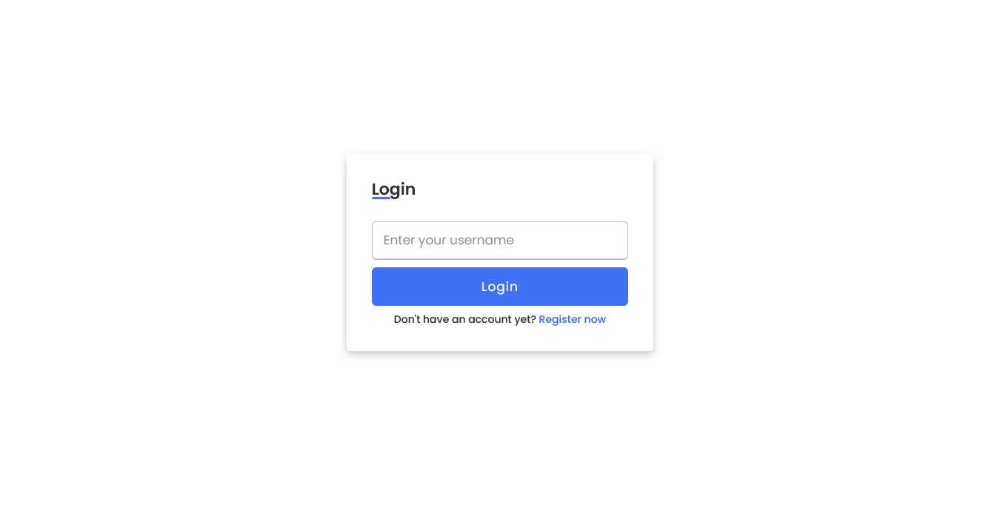
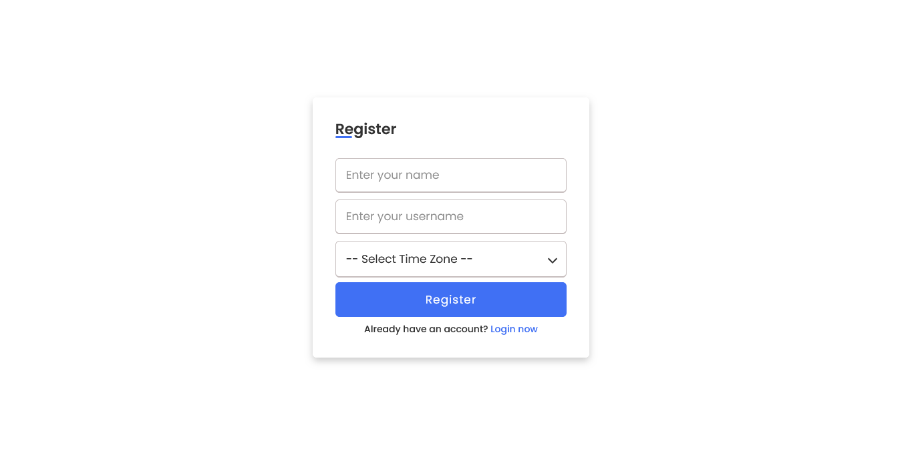
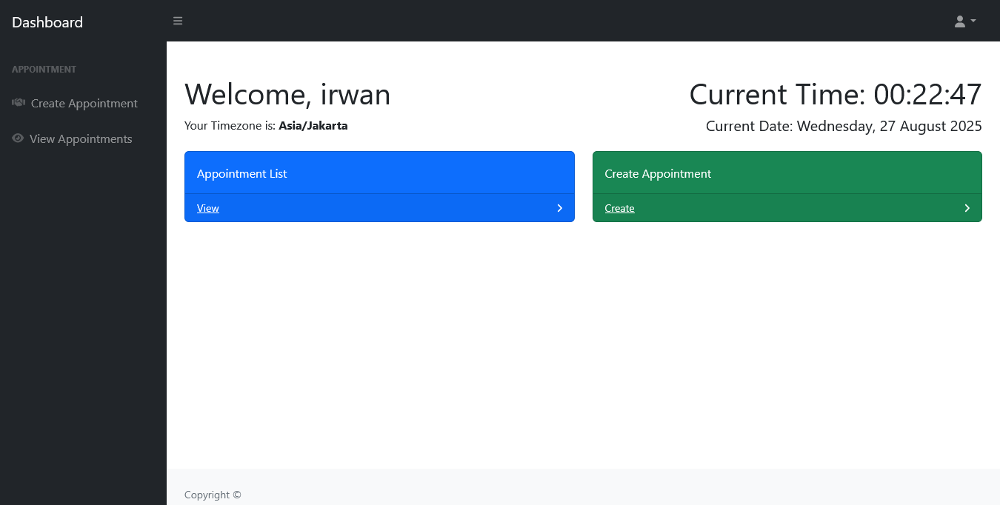
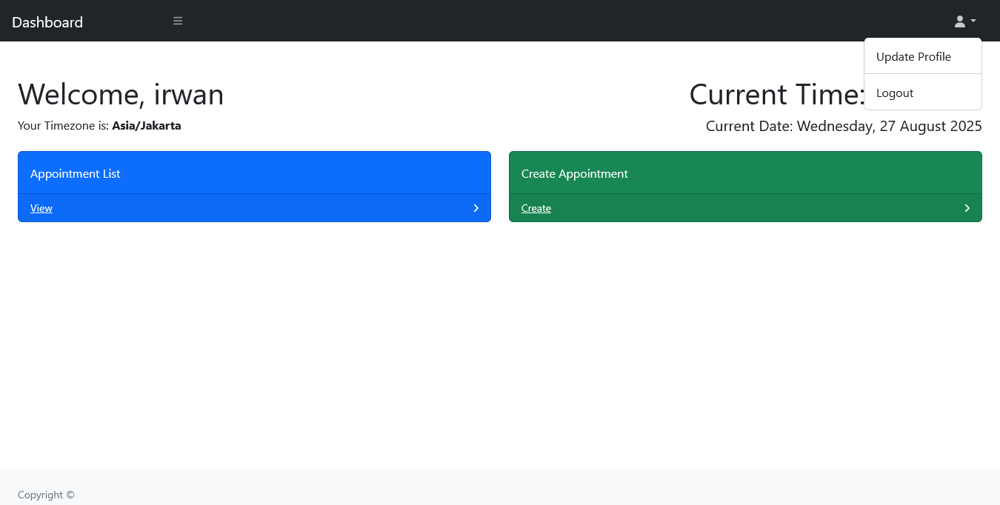
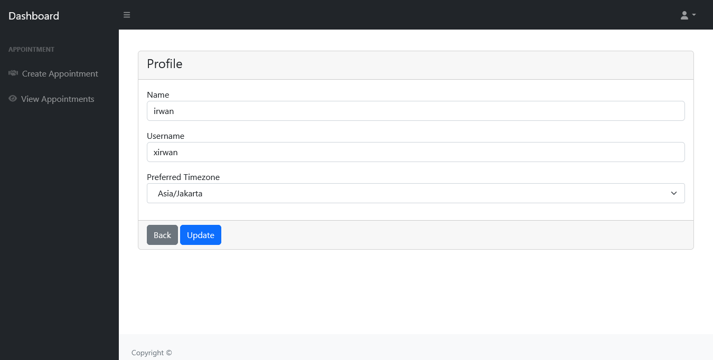
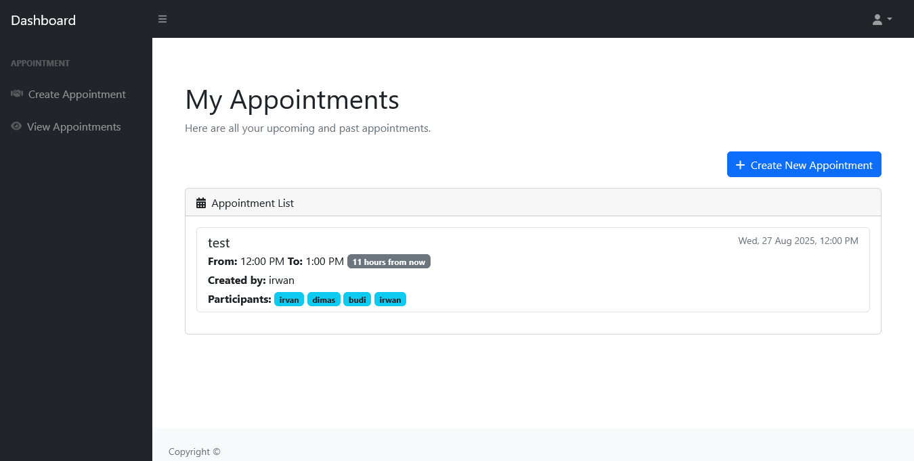
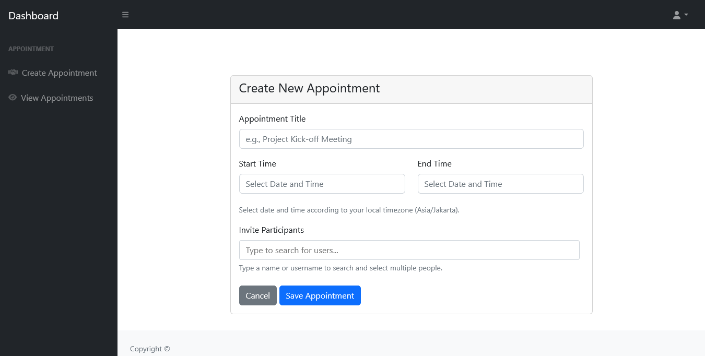

# User Appointment Management System
## Installation
1. Clone this repository using the command: git clone https://github.com/xirwan/user-appointment-management-system.git

2. Run the commands npm install and then composer install.

3. Copy the .env.example file and paste it with the name .env.

4. Set up the database in the .env file according to the database you are using.

5. Run the command php artisan key:generate.

6. Run php artisan migrate.

7. Run php artisan storage:link.

8. Run php artisan serve.

9. The application is ready to use.

## Front End
### Login & Register Page

### Dashboard

### Profile

### Appointment

## Credit
- Login and register page design from https://www.codingnepalweb.com/registration-signup-form-template-html-css/
- Dashboard page design from https://startbootstrap.com/template/sb-admin

## Auhtor
- Irwan